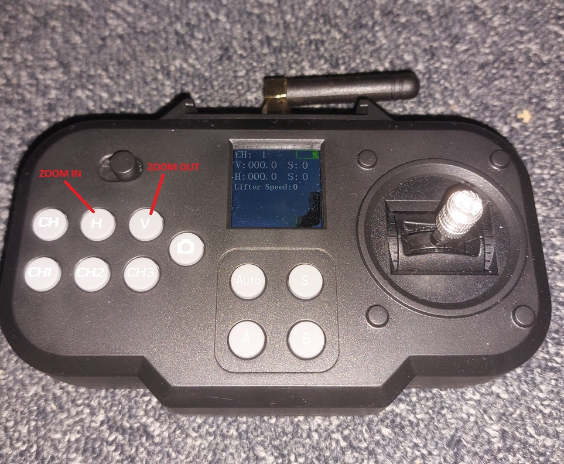
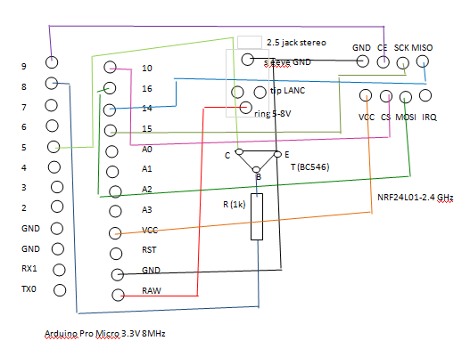
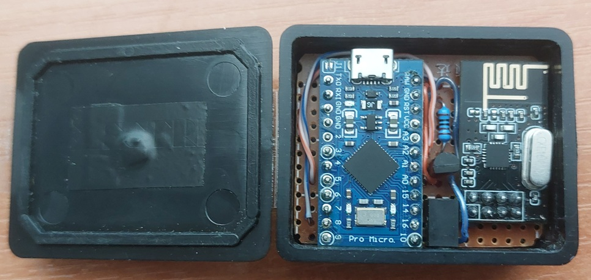
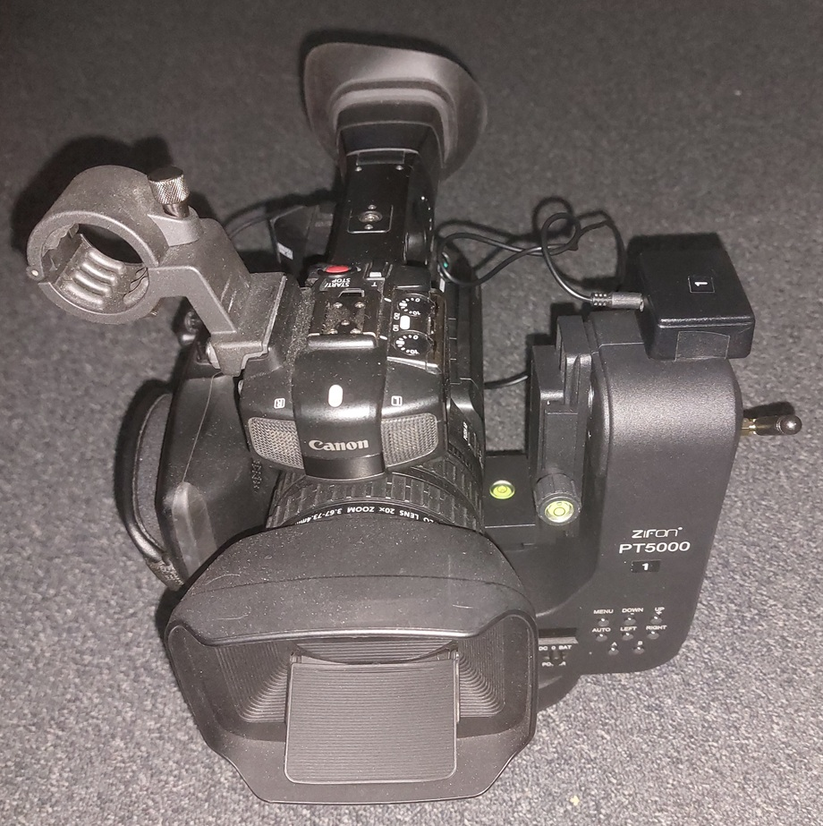

# Zifon 5000 Camera Zoom Controller

Camera zoom control using the original **Zifon 5000 controller**, **Arduino Pro Micro**, and **NRF24L01**.

## Project Overview

The Zifon 5000 motorized camera head is primarily designed for still cameras, and its original wireless controller does not provide direct control of a video camera's zoom.

The goal of this project is to extend the functionality of the original controller so that it can be used not only to control the movement of the motorized head, but also to operate the zoom of a video camera.

An **Arduino Pro Micro with an NRF24L01 module** is used to receive and analyze the original wireless communication transmitted by the Zifon controller.

The Arduino interprets the received commands and converts the relevant controller inputs into commands for the camera's remote zoom interface.

### Zoom Controls

The **H** and **V** buttons on the original Zifon controller are used for zoom control:

* **H** – Zoom In
* **V** – Zoom Out

Pressing either button on its own generates a wireless command, while the motorized head itself does not react to it.

This makes it possible to use the H and V buttons for zoom control without interfering with the original operation of the Zifon head.

---

## How It Works

The basic signal flow is:

```text
Zifon 5000 Controller
          │
          │  2.4 GHz
          ▼
       NRF24L01
          │
          ▼
    Arduino Pro Micro
          │
          │  LANC
          ▼
     Video Camera
```

The **NRF24L01** receives packets transmitted by the original Zifon 5000 wireless controller.

The Arduino analyzes the received data and detects commands corresponding to the **H** and **V** buttons.

These commands are converted into **LANC commands** for controlling the camera zoom.

The original Zifon controller can therefore be used simultaneously for:

* controlling the movement of the motorized camera head,
* Zoom In,
* Zoom Out.

There is no need for a separate handheld zoom controller.

---

## Zifon 5000 Wireless Communication

This project was inspired by the work of **jdesbonnet** and the `zifon_pt5000` project:

https://github.com/jdesbonnet/zifon_pt5000

Many thanks to the author for publishing the results of the Zifon 5000 wireless communication analysis. This information was extremely helpful during the development of this project.

During further investigation of the communication protocol, I also identified how the radio address changes when switching between controller channels.

For each subsequent channel, the value of **every byte in the radio address is incremented by 2**.

### Channel 1

```text
0xA3, 0xAA, 0x16, 0x0C, 0x02
```

### Channel 2

```text
0xA5, 0xAC, 0x18, 0x0E, 0x04
```

### Channel 3

```text
0xA7, 0xAE, 0x1A, 0x10, 0x06
```

This pattern makes it possible to derive the radio addresses used by the other controller channels.

---

## Hardware

The project uses:

* Zifon 5000 motorized camera head
* Original Zifon 5000 wireless controller
* Arduino Pro Micro 3.3 V / 8 MHz
* NRF24L01 2.4 GHz transceiver module
* Video camera with LANC remote control
* Camera interface electronics
* Power supply
* Connecting cables

---

## Schematic

The schematic shows the connection between the **Arduino Pro Micro**, **NRF24L01**, and the camera's **LANC interface**.





---

## Implementation

Prototype and completed hardware implementation:





---

## Arduino Source Code

The Arduino source code is available in the [`src`](src) directory.

The software:

* receives the original Zifon wireless packets using the NRF24L01,
* detects the H and V button commands,
* generates the appropriate LANC commands,
* controls Zoom In and Zoom Out,
* gradually increases the zoom speed while the button is held,
* stops zooming automatically when the button is released.

---

## Features

* Original Zifon 5000 controller remains fully usable
* No modification of the original Zifon transmitter
* Wireless reception using NRF24L01
* Arduino-based packet decoding
* LANC camera control
* Zoom In / Zoom Out using the original H and V buttons
* Variable zoom speed depending on button hold time
* Automatic stop after button release
* No separate handheld zoom controller required
* Possibility of adding additional camera functions

---

## Project Status

The project is functional and under further development.

Additional documentation and improvements may include:

* detailed NRF24L01 configuration,
* captured packet structure,
* complete Zifon command mapping,
* additional camera functions,
* further testing with other cameras.

---

## Acknowledgements

Special thanks to **jdesbonnet** for publishing the analysis of the Zifon 5000 wireless communication:

https://github.com/jdesbonnet/zifon_pt5000

The information provided by this project was an important starting point for my own experiments and further analysis.


---

## Disclaimer

This is an independent experimental DIY project and is not affiliated with, endorsed by, or supported by Zifon.

The project involves reverse engineering and modification of electronic hardware.

All information is provided for experimental and educational purposes. Use it at your own risk.
